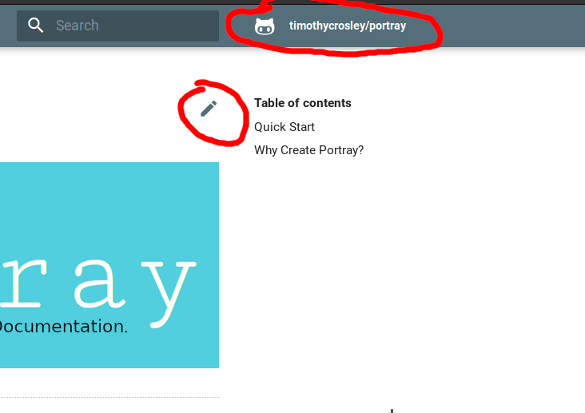

# Troubleshooting / FAQ Guide

As common issues or questions are encountered solutions will be added to this guide.

## `NoProjectFound`

portray raises this exception when it cant find a project in the current directory.
This means that there is no `pyproject.toml` or `setup.py` file in the directory you ran portray
AND that you haven't specified modules to include on the command line.

### Solution 1: Go to root of project
If you do have a `pyproject.toml` or `setup.py` file in your project, chances are you simply accidentally ran
portray from a different directory. Simply changing back to your projects root directory at the same level as
these files should be enough to resolve your issue.

### Solution 2: Create a pyproject.toml file
You can create a simplified `pyproject.toml` file that explicitly specifies what modules are included in your project:

```toml
[tool.portray]
modules = ["MY_MODULE"]
```

### Solution 3: Specify the modules manually from the command line
Every CLI command supports explicitly setting one or more modules using `-m`:

<script id="asciicast-264805" src="https://asciinema.org/a/264805.js" async></script>

## `Unable to identify repo_name, repo_url, and edit_uri automatically.`

This is a warning that is returned when you haven't manually specified these configuration options
and portray is unable to determine them automatically based on your project's repository.
There are many reasons that this can happen, the simplest of which are that your project isn't source
controlled or you utilize a source control system other than git.

### Solution 1: Ignore the warning
These settings are optional and are used only by certain mkdocs themes to provide links back to your repository.



If these features are not relevant to you, you can safely ignore the warning.

### Solution 2: Manually specify settings in `pyproject.toml`
If for any reason portray is unable to determine the repository information from your repo automatically you can
manually specify the settings within your config file:

```toml
[tool.portray.mkdocs]
repo_url = "MY_REPO_URL"
repo_name = "MY_REPO_NAME"
edit_uri = "MY_EDIT_URL"
```

For more information about these settings, refer to the [mkdocs reference documentation](https://www.mkdocs.org/user-guide/configuration/#repo_url).

## Deploying to Netlify

portray includes a built-in command to deploy to [Github Pages](https://pages.github.com/) but it's also compatible with every static website host, including the popular [Netlify](https://www.netlify.com).
There's a great guide on how to set this up contributed by @sw-yx [here](https://scotch.io/@sw-yx/python-the-jamstack).
